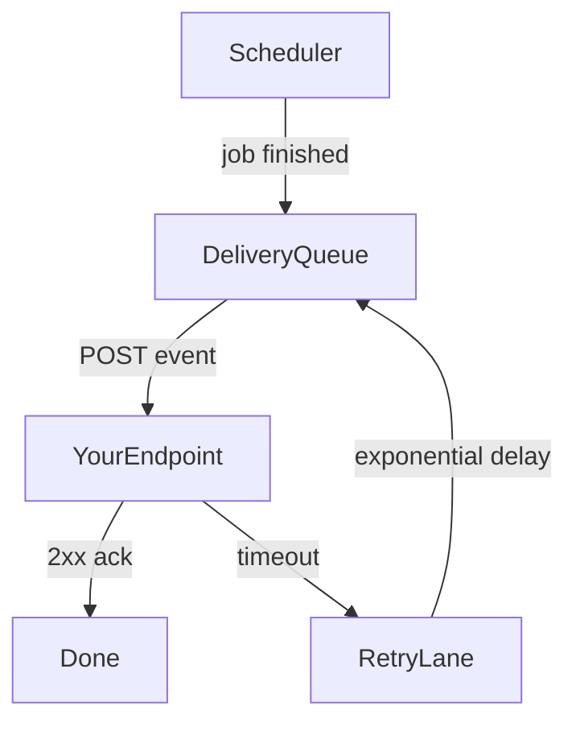

# Webhooks

Driftbeam can push job lifecycle events to your endpoint instead of requiring you to poll.

## Delivery flow

Events travel from the scheduler through the delivery queue before reaching your endpoint.
A delivery that fails with a network error re-enters the queue; a delivery rejected with a 4xx is parked for inspection.



## Verifying signatures

Every delivery carries a signature header computed over the raw body.
Verify it before trusting the payload; reject anything that does not match.

```python
import hmac
import hashlib

def verify_webhook(secret, body, signature_header):
    expected = hmac.new(secret, body, hashlib.sha256).hexdigest()
    return hmac.compare_digest(expected, signature_header)
```

## Tuning redelivery

Redelivery pacing is controlled per endpoint in the webhook block of the project file.
The parked queue holds rejected deliveries for later replay.

```toml
[webhook.redelivery]
max_redeliveries = 7
parked_replay_window_hours = 48
```
