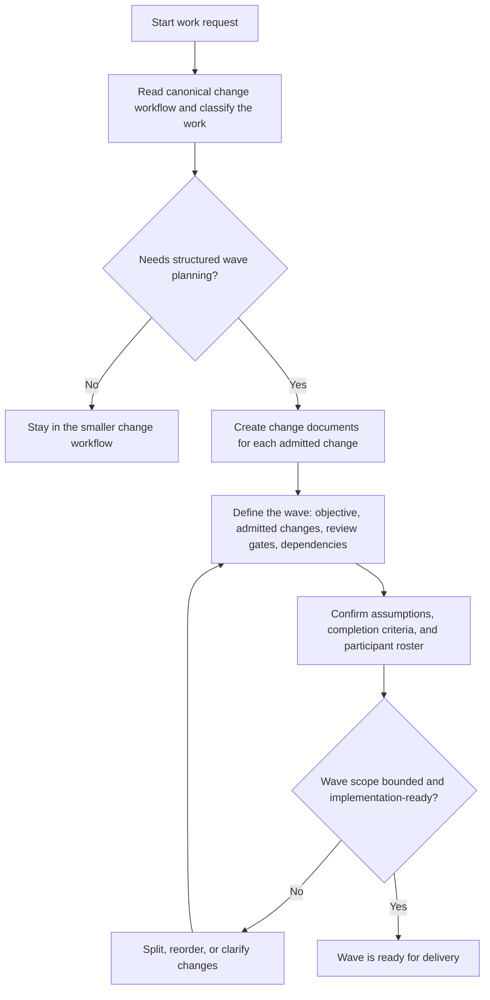
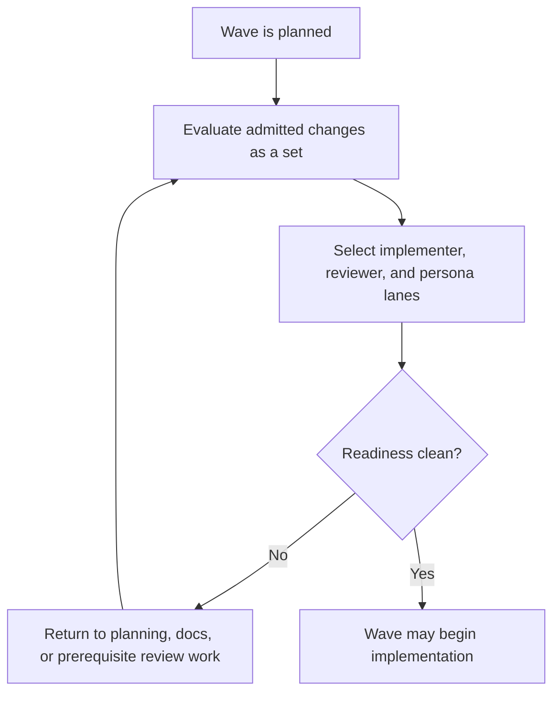
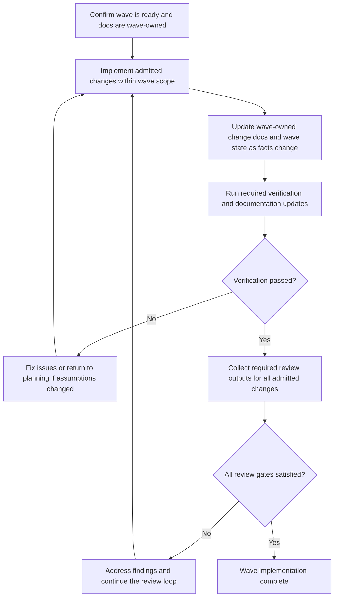
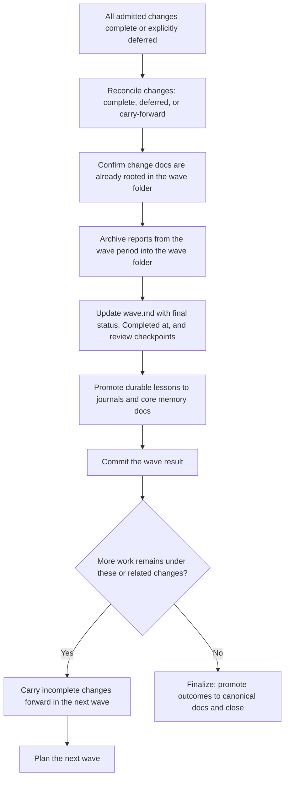

# Feature-Wave Framework Overview

## Purpose

Explain the Wave Framework delivery lifecycle at a high level: how work is grouped into waves, how each wave is readied, implemented, reviewed, and finalized.

**WAVE** stands for **Workflow, Agents, Verification, Engineering**.

Tagline: **Docs-first engineering for agent-driven software delivery.**

## How To Use This Doc

- Use this file as the shared conceptual overview that ships with the seed prompt package.
- Keep project-specific reviewer names, personas, artifact paths, and operating exceptions in the repo-local generated version created during **`Init wave framework`** or **`Upgrade wave framework`** (legacy: **`Init wave context`** / **`Upgrade wave context`**).
- Treat the linked repo-local docs as the source of truth for exact gates and routing for a seeded project (files live in the repository).

## What The Wave System Is

WAVE is the project's docs-first engineering system for organizing workflow, coordinating agent roles, enforcing verification, and guiding delivery through canonical project context.

The **wave** is the primary delivery unit. A wave is a bounded, reviewable container for one or more changes that are planned, implemented, reviewed, and committed together as a cohesive whole.

- A wave admits one or more **changes**, each with a stable `change-id`
- All changes admitted into a wave are implemented and reviewed together as a unit
- The wave is what gets committed and delivered — individual changes do not ship independently outside a wave
- When a wave closes, admitted changes are either complete or explicitly carried forward into the next wave
- The wave folder (`docs/waves/<wave-id>/`) is the active working home and permanent archive: it holds `wave.md`, the admitted change docs relocated there during `Add change to wave`, and any reports from the wave's period

## Core Concepts

- **wave**: the primary delivery unit — a bounded, reviewable container for one or more changes that are planned, implemented, reviewed, and committed together
- **`wave-id`**: uniquely identifies a wave using the format `<prefix> <slug>`:
  - `<prefix>` — 5-character Crockford Base32 timestamp encoding hours since the workflow-configured lifecycle epoch in `docs/workflow-config.json` (`lifecycle_id_policy`) plus a minute bucket, generated by `python3 .wavefoundry/framework/scripts/lifecycle_id.py --kind wave --slug <slug>`
  - `<slug>` — kebab-case human-readable description of the wave's theme
  - Example: `1a2yy routine-behavior-contract`
  - The legacy baseline wave reserves `00000` as its prefix: `00000 wave-zero-plans-and-specs`
- **change**: a tracked unit of work admitted into a wave — a bug fix, feature, enhancement, refactor, or other concrete change; represented by a consolidated change document that starts in `docs/plans/<change-id>.md` and moves into `docs/waves/<wave-id>/<change-id>.md` during `Add change to wave` before implementation
- **change-id**: identifies one tracked change within a wave, using the format `<prefix>-<kind> <slug>` where `<kind>` is one of: `bug`, `feat`, `enh`, `change`, `doc`, `debt`, `ref`, `task`, `maint`, `ops`; for example `1mgvf-enh routine-status-contract-centralization`
- **active wave**: the wave currently being implemented and reviewed
- **carry-forward**: a change not completed when a wave closed, admitted into the next wave with its unfinished work made explicit
- **finalize**: the wave closure step that promotes durable outcomes into canonical docs, archives completed artifacts, and marks the wave permanently closed

## Lifecycle At A Glance

1. Plan the wave — define scope, admit changes, establish review gates.
2. Ready the wave — validate that admitted change docs are already wave-owned, repair placement drift if needed, evaluate the admitted changes, select required implementer, reviewer, persona, and council lanes, run the Wave Council readiness pass when the project enables it, and block start until readiness is clean.
3. Implement the wave — beginning with a mandatory **pre-implementation review gate** (pre-mortem, packet completeness check, and recorded verdict) before the first code edit, then implement all admitted changes.
4. Review the wave — run required review lanes as a unified set, run the Wave Council delivery pass when the project enables it, and rerun readiness at final review.
5. Close and commit the wave — record completion, reconcile wave-owned change docs and reports, commit the result.
6. Either plan the next wave (carry incomplete changes forward) or finalize.

- **Execution ordering:** Steps 3–4 are **interleaved** while the wave is active (see section 3): implement, verify, run required reviewer lanes, and return to implementation when findings block. **`Review wave`** is the explicit operator shortcut for that review work under the same coordinator-owned execution contract as **`Implement wave`**. **Close** adds a **final** readiness pass so triggers that emerged during implementation are not skipped; it does **not** replace required review during execution.

## 1. Plan A Wave And Its Changes



- Start by classifying the work and deciding whether it can stay in the smaller default workflow or needs the full wave lifecycle.
- Create a consolidated change document (`docs/plans/<change-id>.md`) for each tracked change admitted into the wave, then move the admitted docs into `docs/waves/<wave-id>/` during `Add change to wave` before implementation begins.
- Define the wave record under `docs/waves/<wave-id>/wave.md` with: objective, admitted changes as `## Changes`, completion criteria, review checkpoints, and participant roster.
- A wave may admit one or more changes when their assumptions, dependencies, and review timing are compatible enough to execute together.
- For exact planning rules, use the seeded project's feature workflow, planning prompt, and plan/spec conventions.

## 2. Ready The Wave



- A wave should not start implementation until a readiness evaluation has passed.
- Readiness includes validating that admitted change docs are already in `docs/waves/<wave-id>/`, repairing staged-only drift when needed, and clearing duplicate staging copies.
- The readiness evaluation determines which implementer lanes, reviewer lanes, persona lanes, and any required Wave Council seats must participate.
- If a user asks to implement the wave directly, the coordinator should run or confirm this readiness evaluation automatically first.
- When the project enables Wave Council, readiness is not complete until the council-moderator has synthesized the isolated council-seat outputs into a recorded `wave-council-readiness` verdict and the wave record contains a structured `prepare-council` verdict line in `## Review Checkpoints`.

## 3. Implement The Wave



- Implementation should stay inside the admitted wave scope; changes outside the wave must wait for the next wave.
- Implementation should start only after readiness has passed; otherwise the coordinator must block and repair the prerequisites first.
- The mandatory first phase of `Implement wave` is a **pre-implementation review gate**: the coordinator runs a pre-mortem (3–5 most likely failure modes), verifies packet completeness, and records a `pre-implementation-review: passed/blocked (<date>)` verdict in `## Review Checkpoints` before the first code edit. No code edit may begin until the verdict is `passed`. If Wave Council is enabled, the gate also requires the structured `prepare-council` verdict line before implementation may start.
- Admitted change docs should already live under `docs/waves/<wave-id>/` after `Add change to wave`; `Prepare wave` repairs drift defensively if staging copies remain.
- Verification follows the project's build, test, docs, and smoke-check procedures before wave closure.
- For exact reviewer roles, personas, and gate triggers, use the seeded project's agent-team workflow and review docs.
- When the project enables Wave Council, delivery review includes a second council pass after implementation: isolated seat outputs first, then council-moderator synthesis into a recorded `wave-council-delivery` verdict.

## 3a. Implement Loop Execution Model

The coordinator's implement loop is structured as a **ReAct-derived execution model** — a repeating cycle of explicit Reasoning, Action, and Observation that makes the coordinator's decisions auditable, the loop resumable, and findings classified at the right escalation level before looping back.

### Loop Structure

Each iteration of the implement loop follows this pattern:

```
Thought  → why this action now (recorded in Progress Log before every lane invocation)
Action   → a single, scoped lane invocation (implementer task, reviewer lane, or persona lane)
Observe  → structured output of that lane (test results, review findings, build state)
[Reflect] → root cause pattern when a blocking finding occurs (informs remaining tasks)
→ repeat
```

### Wave Plan

Before the first edit, the coordinator produces an ordered execution plan: which lanes run in which order, with what scoped inputs, for each serialization unit. Deviations from the plan are named events recorded in the Progress Log — not silent reorderings. This is the pre-implementation plan that the operator approves before coding begins.

### Parallel Lane Merge

Reviewer and persona lanes that share no dependencies run concurrently. The coordinator records a single merged `Observe:` entry synthesizing all concurrent lane outputs before emitting the next `Thought:`. This prevents the coordinator from acting on partial findings from one lane while others are still running.

When Wave Council is enabled, the council seats also run in parallel on an isolated first pass. The council-moderator — not the wave-coordinator — owns the synthesis step, optional targeted challenge round on material disagreement, and final council verdict. The wave-coordinator remains responsible for lifecycle routing and gate enforcement.

### Finding Classification (CRITIC)

After each review cycle the coordinator evaluates every finding against the change doc's `## Acceptance Criteria` before deciding which loop to activate. "All reviewer lanes clean" is not sufficient — the exit condition is "all acceptance criteria met." This classification step prevents waves that satisfy every reviewer lane but miss a criterion no lane was explicitly checking.

### Root Cause Capture (Reflexion)

After any blocking finding the coordinator records a `Reflect:` entry identifying the root cause pattern and updating remaining tasks proactively to avoid the same class of finding recurring within the same wave. Persistent patterns from Reflexion entries are promoted to the wave's incident journal.

### Three Loop Levels

The implement loop has three distinct levels. The finding type — not severity alone — determines which level activates:

| Level | Name | Trigger | Action |
|---|---|---|---|
| **1** | Micro | Implementer observes test/build failure within a single task | Fix in place; stays internal to the implementer sub-agent; no Progress Log entry required |
| **2** | Reviewer loop | Review finding does not invalidate any acceptance criterion | Fix, re-invoke affected reviewer lane(s), merge observations, continue; `Prepare wave` does not re-run |
| **3** | Wave lifecycle | Finding invalidates an acceptance criterion, contradicts the approved plan, crosses an architecture boundary, or reveals a scope or requirement ambiguity | Stop, surface to operator, route to `Plan feature` or re-`Prepare wave` before continuing |

**Finding escalation reference:**

| Finding type | Level | Coordinator action |
|---|---|---|
| Code quality, style, formatting | 2 | Fix in place, re-run reviewer lane |
| Missing test coverage | 2 | Add tests, re-run qa-reviewer |
| Logic error, missing behavior | 2 | Fix, re-run affected lanes |
| Scope creep discovered during implementation | 3 | Stop, update change doc, operator resolution, re-Prepare |
| Finding invalidates an acceptance criterion | 3 | Stop, surface to operator, route to Plan feature or re-Prepare |
| Architecture boundary violation | 3 | Stop, route to architecture-reviewer + operator, re-Prepare |
| Requirement ambiguity blocking implementation | 3 | Stop, operator resolution, update change doc, re-Prepare |
| Accepted tradeoff with recorded rationale | Exit loop | Record in change doc, continue |

### Auditability and Resume

The structured Thought→Action→Observe record in `## Progress Log` means any session can resume a paused wave by reading the last Observation and computing the next Thought — without reconstructing coordinator state from chat history. Level 2 loops stay in the implementation phase; only Level 3 escalation sends the wave back to planning or re-Prepare.

## 4. Close And Commit The Wave



- Closing a wave means reconciling every scoped change — not just marking the wave done.
- Ensure all admitted change plan files were moved from `docs/plans/` into `docs/waves/<wave-id>/` during `Add change to wave`, then leave them there through closure.
- Move all reports from `docs/reports/` that fall within the wave's active period into `docs/waves/<wave-id>/` and summarize them in `## Reports` in `wave.md`.
- Record `Completed at` in `wave.md` when the wave is formally closed.
- Rerun the readiness evaluation during final review before closure so new reviewer or persona triggers introduced during implementation do not get skipped.
- The wave folder (`docs/waves/<wave-id>/`) becomes the self-contained permanent archive.
- If changes remain, carry them forward in the next wave — do not let incomplete work drift without a new wave home.
- If no work remains, finalize: promote durable behavior into canonical docs, persona guidance, workflow memory, and journals.

## Canonical References

- `.wavefoundry/framework/seeds/002-wave-framework-seeding-overview.md`
- `.wavefoundry/framework/seeds/004-wave-memory-overview.md`
- `.wavefoundry/framework/seeds/005-persona-system-overview.md`
- `.wavefoundry/framework/seeds/006-agent-journal-system-overview.md`
- `.wavefoundry/framework/seeds/007-review-system-overview.md`
- `docs/contributing/change-workflow.md`
- `docs/contributing/feature-workflow.md`
- `docs/contributing/discovery-delivery-workflow.md`
- `docs/contributing/review-and-evals.md`
- `docs/waves/README.md`
- `docs/prompts/plan-feature.prompt.md`
- `docs/prompts/implement-feature.prompt.md`
- `docs/prompts/finalize-feature.prompt.md`
