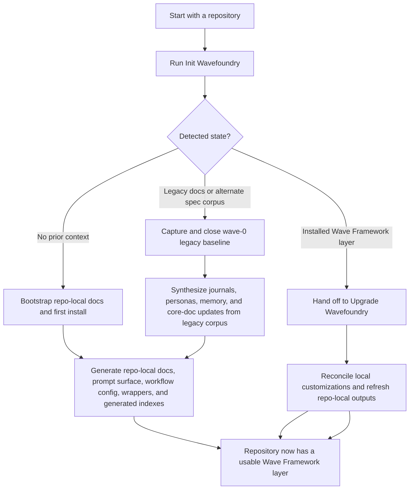

# Wave Framework Seeding Overview

This document explains how the Wave Framework is seeded into a project's repository, how first-time initialization differs from upgrade and migration, and what an implementing team should understand before adopting it.

## What The Wave Framework Is

The Wave Framework is a seeded prompt-and-docs operating system stored in `.wavefoundry/framework/`. It is not meant to be used only from this shared folder. Instead, the shared pack is planted into a target repository and then used to generate or refresh repo-local artifacts under `docs/`, root agent entry files, and optional platform-native wrappers.

**WAVE** stands for **Workflow, Agents, Verification, Engineering**.

WAVE is the project's docs-first engineering system for organizing workflow, coordinating agent roles, enforcing verification, and guiding delivery through canonical project context.

Tagline: **Docs-first engineering for agent-driven software delivery.**

Key model:

- the shared prompt pack stays generic
- the target project owns its generated outputs in the repository
- repo-local outputs are derived from evidence in the repository, not copied blindly
- upgrades preserve valid repo-grown artifacts when possible
- a `00000 wave-zero-plans-and-specs` is the reserved closed historical baseline created from pre-wave legacy corpora when they exist
- `wave-0` is the project's first installed Wave Framework layer in the repository, created after init has classified installed state and harvested any needed baseline corpus
- seeded policy and procedure docs must be project-specific and operationally usable, not shallow mirrors of the shared framework pack

## Voice: project vs repository

When generating or editing seeded docs, public prompts, and thin wrappers:

- Prefer **project** for delivery, product, roles, workflows, and collaboration.
- Use **repository** when the meaning is placement in the VCS tree: **repository root**, **repository code** (the `AGENTS.md` stage-gate term), **target repository** / **checked-in** paths, init or upgrade of the repo tree, and shorthand like “evidence from the repository.”

Init and upgrade prompts (`010`, `160`), agent entry generation (`050`), prompt-surface bootstrap (`100`), and coordinator execution (`180`) should follow this split so generated `AGENTS.md` and `docs/prompts/*` stay aligned with the project-first voice.

## Core Concepts

### Seeded, not mirrored

Seeding means the framework reads the project's current structure, workflows, prompts, and operating constraints from the repository, then writes a repo-local context layer that matches that project.

This usually creates or refreshes:

- canonical docs under `docs/`
- a project orientation overview at `docs/references/project-overview.md`
- a repo-specific feature/wave lifecycle companion at `docs/contributing/feature-wave-lifecycle-overview.md`, derived from `.wavefoundry/framework/seeds/001-feature-wave-framework-overview.md` and adapted to local reviewers/personas
- public prompt entry docs under `docs/prompts/`
- agent-oriented prompt bodies under `docs/prompts/agents/` when the project keeps checked-in planning/context prompt bodies separate from the public shortcut surface
- workflow config in `docs/workflow-config.json`, including **`lifecycle_id_policy`** when the install ships `lifecycle_id.py` so epoch and optional hour offset are explicit for new repositories
- refresh-first manifests, handoff snapshots, wave state, and journal artifacts in their topical `docs/` homes such as `docs/prompts/`, `docs/agents/`, and `docs/waves/`, with explicit regeneration paths documented nearby
- optional agent-role wrappers and root entrypoint files such as `AGENTS.md`, `CLAUDE.md`, and `WARP.md`
- docs tooling: **`wf docs-lint`** and **`wf docs-gardener`** for hooks, CI, and CLI fallback; **agents** with the Wavefoundry MCP server should prefer **`wave_validate`**, **`wave_garden`**, and **`wave_audit`** over shelling to the `wf` dispatcher (see `seed-050` / `seed-080`)

### Waves as the operating model

The framework assumes work should be grouped into waves when assumptions and boundaries are stable enough to support parallel or staged execution. The seeded context is meant to help a project:

- describe boundaries and shared assumptions clearly
- plan non-trivial work in a docs-first way
- preserve agent handoff and journal context across sessions
- route people and agents toward canonical docs instead of duplicating instructions everywhere

The shared conceptual explanation of that lifecycle lives in `.wavefoundry/framework/seeds/001-feature-wave-framework-overview.md`. Seeded repositories should generate a project-specific companion under `docs/contributing/` that adds local reviewer roles, personas, and artifact specifics without changing the shared model.

The maintainer-facing create/refresh/preserve rules for seeding and upgrade live in `.wavefoundry/framework/seeds/009-framework-maintenance-contract.md`.

### Legacy baseline wave and `wave-0` first-install state

A `00000 wave-zero-plans-and-specs` is the reserved baseline wave for historical material that predates the wave model.

- create it during **`Init Wavefoundry`** (legacy: **`Init wave framework`** / **`Init wave context`**) when the repository contains legacy `project-context` artifacts, OpenSpec material, or other custom spec/feature/change corpora that should seed the wave system
- move or normalize those legacy documents into `docs/waves/00000 wave-zero-plans-and-specs/`
- keep the wave folder flat: a single `wave.md` file holds all baseline content (corpus inventory, normalization notes, review checkpoints, journal refs); do not create subdirectories like `legacy/` or `evidence/` inside the wave folder
- give the closed baseline wave a final title that starts with `Legacy`, using `Legacy` for broad mixed corpora or a generated title such as `Legacy plans and specs` when the harvested material is more specific
- synthesize journals, persona starting guidance, workflow memory, and shared-core-doc updates from that baseline corpus
- close the wave-0 legacy baseline only after the baseline synthesis and close-wave follow-through are complete, including journal distillation, workflow-memory promotion, persona refresh when needed, and explicit completion metadata in the wave-0 baseline wave record

`wave-0` is the first installed wave-context state for a repository.

- a repository that starts with no prior framework reaches `wave-0` through **`Init Wavefoundry`** (legacy: **`Init wave framework`** / **`Init wave context`**)
- a repository that starts with legacy material reaches `wave-0` after init captures and closes the wave-0 baseline
- a repository that already has an installed Wave Framework layer may be handed off from init detection to **`Upgrade Wavefoundry`** (legacy: **`Upgrade wave framework`** / **`Upgrade wave context`**)
- legacy aliases may still be recognized to help old repositories move forward

## Public Commands And Routing

The intended public surface is:

- `Init Wavefoundry` (legacy aliases: `Init wave framework`, `Install wave framework`, `Init wave context`, `Install wave context`)
- `Upgrade Wavefoundry` (legacy aliases: `Upgrade wave framework`, `Upgrade wave context`, `Install wave framework` when init hands off to upgrade)
- `Plan feature`
- `Create wave`
- `Add change to wave`
- `Remove change from wave`
- `Prepare wave`
- `Implement wave`
- `Implement feature`
- `Pause wave`
- `Review wave`
- `Close wave`
- `Finalize feature`

Alias behavior:

- **`Install Wavefoundry`** / **`Install wave framework`** (legacy: **`Install wave context`**) is a convenience alias resolved through init-phase detection, not a separate parallel entrypoint
- route **`Install Wavefoundry` / `Install wave framework` / `Install wave context`** through **`Init Wavefoundry`** first so repository-state detection can decide whether to clean-bootstrap, harvest the reserved legacy baseline wave, or hand off to upgrade
- migrations should normalize onto the product-branded canonical phrases **`Init Wavefoundry` / `Upgrade Wavefoundry`** (`Init wave framework`, `Upgrade wave framework`, `Install wave framework`, `Init wave context`, and `Upgrade wave context` remain accepted backwards-compatible aliases).

## Seeding Workflow

## First-Time Initialization

Use **`Init Wavefoundry`** (legacy: **`Init wave framework`** / **`Init wave context`**) as the first-phase detector for repositories of any state.

The init flow should:

1. inspect evidence from the repository and classify the state as no prior context, legacy corpus present, or already-installed wave context
2. when legacy corpus is present, create and close the reserved legacy baseline wave
3. establish canonical docs structure
4. create the public prompt surface under `docs/prompts/`
5. seed supporting prompt bodies under `docs/prompts/agents/` when the project uses them
6. seed workflow configuration and generated artifact roots
7. create thin root entry wrappers and supported platform-native pointers
8. run docs verification so the seeded surface is internally consistent

Expected outcome:

- the project gains its first complete repo-local context layer at `wave-0`, optionally preceded by a closed dated legacy baseline capture
- future planning and implementation prompts can rely on local canonical docs
- later maintenance should usually happen through **`Upgrade Wavefoundry`** (legacy: **`Upgrade wave framework`** / **`Upgrade wave context`**), not by re-running init blindly

## Repo-Generation Contract Summary

Use the full contract in `.wavefoundry/framework/seeds/009-framework-maintenance-contract.md` when maintaining the framework. The short version is:

- init creates the first complete repo-local Wave Framework layer
- upgrade reads existing local state first, then refreshes or migrates it
- refreshable files may be regenerated when the shared contract owns them
- repo-specific reviewer, persona, and workflow details should be preserved or merged when they remain supported by evidence from the repository

## Golden-Path Adoption Examples

Use these examples to sanity-check whether the framework is still understandable as an end-to-end system:

1. A project with no prior install runs **`Init Wavefoundry`** (legacy: **`Init wave framework`** / **`Init wave context`**), receives the local docs/prompt/memory layer, then uses `Plan feature` plus `wf lifecycle-id --kind wave --slug <slug>` to start the first normal wave after `wave-0` scaffolding is in place.
2. A project in mid-delivery completes part of a wave, carries unfinished work into the next wave under the same `change-id`, and refreshes wave memory, journals, and handoff state instead of pretending the feature is fully closed.
3. A project that has completed planning runs `Prepare wave`, records the required implementer, reviewer, and persona lanes (including **`product-owner`** when product semantics move, and again after **`Add change to wave`** changes the admit set), and only then begins implementation. `Ready wave` remains an accepted alias.
4. A project that has completed the planned work runs **`Review wave`** to **execute and record** the **Prepare wave** reviewer matrix (verdicts in **Review checkpoints**), reruns the **readiness evaluation** as part of that closure review, then runs `Finalize feature` or `Close wave`, records **docs-contract review** in the wave when `docs/specs/*.md` or other behavior contracts changed, promotes durable lessons into canonical docs and long-lived memory, archives temporary execution artifacts, and closes the feature or wave cleanly.

## Upgrade And Migration

Use **`Upgrade Wavefoundry`** (legacy: **`Upgrade wave framework`** / **`Upgrade wave context`**) when init has already determined that the repository contains an installed Wave Framework layer that needs refresh or reconciliation.

When one or more `wavefoundry-MAJOR.MINOR.PATCH.<build>.zip` distribution files exist at the **repository root**, under `~/.wavefoundry/`, or under `~/.wavefoundry/dist/`, the upgrade entrypoint (`160-upgrade-wavefoundry.prompt.md` **step 0**) should adopt the highest semver zip, regenerate tracked hooks via `wf render-surfaces`, then continue with exploration, version guard (`VERSION` vs `docs/prompts/prompt-surface-manifest.json` **`framework_revision`**), and the rest of the upgrade flow — so operators can drop or build a new pack and run a single **Upgrade Wavefoundry** (legacy: **Upgrade wave framework** / **Upgrade wave context**) without a separate manual unzip step.

The upgrade flow should:

1. inspect the current local context state
2. detect whether legacy migration is required
3. preserve valid repo-grown docs, personas, wrappers, and journals where supported
4. backfill missing wave-era artifacts
5. reconcile `AGENTS.md` **Implementation guard** and implement/plan prompt guardrails with the current `050` / `100` standards (same obligations as init — `160-upgrade-wavefoundry.prompt.md` and `150-refresh-wavefoundry.prompt.md`)
6. retire stale legacy references only after replacement artifacts exist
7. rerun docs verification to confirm the refreshed surface is coherent

Expected outcome:

- an older project preserves its pre-wave historical corpus in a closed reserved legacy baseline wave, then continues on the current Wave Framework surface without unnecessary loss of local knowledge
- a current wave-context install can be refreshed without resetting its project-specific adaptations

## What Gets Seeded Into A Project

At a base level, an implementation should expect the framework to establish these categories of outputs:

| Category | Typical outputs | Why it matters |
| --- | --- | --- |
| Canonical docs | `docs/README.md`, `docs/ARCHITECTURE.md`, `docs/PLANS.md`, contributing docs | Gives the project a system of record for decisions, workflows, and architecture. |
| Project orientation | `docs/references/project-overview.md` | Gives people and agents a concise starting point for the project workflow, the major docs, the active roles/personas, and how collaboration is expected to work. |
| Public prompt surface | `docs/prompts/*.md` | Defines the commands users and agents should actually invoke. |
| Agent prompt bodies | `docs/prompts/agents/*.md` | Stores checked-in agent-oriented planning/context prompt bodies without treating them as public commands. |
| Workflow config | `docs/workflow-config.json`, `docs/repo-profile.json` | Makes repo-specific policy and generation settings explicit. |
| Refresh-first artifacts | topical docs such as prompt manifests, session handoff artifacts, wave state, journals, and other docs with explicit regeneration paths | Supports indexing, drift detection, and continuation between sessions without forcing durable docs into a generic folder. |
| Agent entry surfaces | `AGENTS.md`, `CLAUDE.md`, `WARP.md`, optional native role wrappers | Gives each host environment a thin entrypoint back to the canonical docs. |
| Docs tooling | MCP **`wave_validate`** / **`wave_garden`** / **`wave_audit`** for agents when registered; **`wf docs-lint`**, **`wf docs-gardener`** for hooks, CI, and no-MCP CLI | Enforces docs consistency and helps maintain the seeded surface over time. |

## Seeded Project Overview Document

The shared seed pack should require a repo-local overview at `docs/references/project-overview.md`.

That document should help a newly arriving person or agent understand, at minimum:

- which canonical docs matter first and what each one is for
- how work normally flows through planning, implementation, review, finalization, and handoff
- which generic agent roles or review lanes the project expects to use
- which synthesized project personas exist, what they are responsible for, and when they should engage
- how generic roles, project personas, coordinators, and reviewers collaborate without duplicating each other

When useful, this overview should include a lightweight workflow diagram so project participants can visualize how requests move through the seeded process.

## Key Points For Implementers

### Treat the shared pack as infrastructure, not the final product

The shared files in `.wavefoundry/framework/` should stay generic. Repository-specific instructions belong in the generated repo-local docs.

### Prefer explicit init/upgrade language in durable docs

Even if **`Install wave context`** is accepted interactively, durable docs and handoffs should prefer **`Init Wavefoundry`** and **`Upgrade Wavefoundry`** (legacy phrases such as **`Init wave framework`** / **`Upgrade wave framework`** remain valid) so routing intent stays unambiguous.

### Preserve local evidence during upgrade

An upgrade should reconcile and refresh. It should not wipe out repo-grown artifacts just because the shared pack evolved.

### Put durable docs in topical folders first

The framework should keep refresh-first coordination artifacts in the topical `docs/` folders that match their roles, not in a generic catch-all directory. If a seeded doc functions mainly as architecture guidance, workflow policy, reference material, or reports, place it in the topical folder that matches that role and register its regeneration path separately when needed.

### Keep thin wrappers thin

Files like `AGENTS.md`, `CLAUDE.md`, and platform-native wrappers should keep long policy in canonical docs instead of duplicating it — except where the repo intentionally encodes a short **Implementation guard** (plan + readiness before product-code edits) directly in `AGENTS.md` for agent enforcement.

### Implementation guard for product code (seeded by init when applicable)

`050-agent-entry-surface-bootstrap.prompt.md` instructs init to add **Implementation guard (product code)** to `AGENTS.md` when `docs/repo-profile.json`, inventory, or `docs/repo-index.md` indicates shipped product code (see that prompt for decision signals). The guard requires a consolidated change document plus recorded readiness before the first product-source edit, with an explicit operator waiver escape hatch; thin pointers reference the guard when the section exists. Documentation-only repos omit it or get a one-line placeholder for later. `160-upgrade-wavefoundry.prompt.md` backfills the section when a repo gains product code or when an older install predates the guard. The shared coordinator shortcut `180-implement-feature.prompt.md` always points at `AGENTS.md` so the guard is enforceable once present. Domain specifics (vendor SDK quirks, dual grace maps, etc.) belong in `docs/specs/` and role docs, not in the generic `AGENTS.md` template.

### Give newcomers one collaboration-oriented starting point

The seeded project overview should connect the documentation map to the operating model. A reader should be able to open one doc and quickly understand how work enters the project (through artifacts in the repository), which docs govern it, and how roles, agents, and personas coordinate.

### Verify after seeding

After init or upgrade, run the docs gate from the repository root so prompt docs, metadata, indexes, and references stay aligned.

### Expect the framework to evolve in two layers

- shared framework evolution happens in `.wavefoundry/framework/`
- project adaptation happens in repo-local docs and generated artifacts

That separation is what lets one shared framework support multiple repositories without flattening their differences.

## Related Docs

- `.wavefoundry/framework/README.md`
- `.wavefoundry/framework/seeds/010-install-wavefoundry.prompt.md`
- `.wavefoundry/framework/seeds/160-upgrade-wavefoundry.prompt.md`
- `.wavefoundry/framework/seeds/220-legacy-framework-migration.prompt.md`
- `docs/prompts/index.md`
- `docs/contributing/change-workflow.md`
