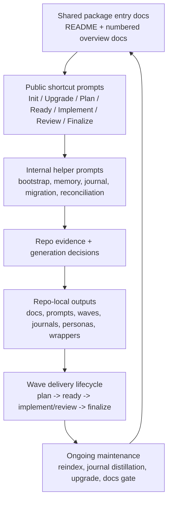

# Wave Framework Map

This document is the maintainer-facing map of how the shared Wave Framework package is organized, how its major layers relate to one another, and which repo-local outputs are expected to exist after seeding.

## Purpose

- Show the framework as a system of connected parts rather than only a sequence of prompts.
- Help maintainers understand which artifacts are public entry points, which prompts are internal helpers, and which outputs are generated into a target project's repository.
- Provide a stable navigation map for later framework-hardening docs such as the completeness contract and maintenance rules.

## At A Glance

## Framework Layers

### 1. Entry and navigation layer

These files explain the framework and route maintainers toward the right operating documents before they touch prompts:

- `.wavefoundry/framework/README.md`
- `.wavefoundry/framework/seeds/001-feature-wave-framework-overview.md`
- `.wavefoundry/framework/seeds/002-wave-framework-seeding-overview.md`
- subsystem overviews `003-007`
- this file, `008-framework-map.md`

### 2. Public command layer

These are the durable shortcut entry points that seeded repositories expose to users and agents:

- `Init wave framework` (legacy aliases: `Install Wavefoundry` / `Install wave framework` / `Init wave context`)
- `Upgrade wave framework` (legacy aliases: `Upgrade Wavefoundry` / `Upgrade wave context`)
- `Plan feature`
- `Create wave`
- `Add change to wave`
- `Remove change from wave`
- `Prepare wave`
- `Implement wave`
- `Implement feature`
- `Pause wave`
- `Review wave`
- `Close wave`
- `Finalize feature`

In the shared pack, those map to:

- `010-install-wavefoundry.prompt.md`
- `160-upgrade-wavefoundry.prompt.md`
- `170-plan-feature.prompt.md`
- `180-implement-feature.prompt.md` for `Prepare wave`, `Implement wave`, `Pause wave`, and `Review wave`
- `180-implement-feature.prompt.md`
- `190-finalize-feature.prompt.md`

### 3. Internal helper prompt layer

These prompts shape seeding, reconciliation, and maintenance behavior but are not intended to be the public shortcut surface in a seeded project:

- bootstrap and generation helpers: `020-150`
- wave and journal helpers: `200-210`
- migration helper: `220-legacy-framework-migration.prompt.md`

Maintain these prompts as the implementation layer behind the public commands and the shared docs.

### 4. Repo-local output layer

Init and upgrade generate or refresh repo-local outputs derived from evidence in the repository. The most important output families are:

- canonical docs under `docs/`
- prompt entry docs under `docs/prompts/`
- optional prompt bodies under `docs/prompts/agents/`
- wave state and execution artifacts under `docs/waves/`
- journals, handoff, and personas under `docs/agents/`
- project references and memory under `docs/references/`
- root wrappers and entry files such as `AGENTS.md`, `CLAUDE.md`, `WARP.md`, `.wavefoundry/bin/docs-lint`, and `.wavefoundry/bin/docs-gardener` (bin launchers for hooks/CI/CLI; **agents** prefer MCP **`wave_validate`** / **`wave_garden`** when the server is attached — `seed-050`)

### 5. Review and verification layer

The framework expects repo-local work to close the loop through:

- docs gate verification
- review lanes and repo-local reviewer routing
- wave reconciliation and carry-forward handling
- journal distillation and memory promotion
- upgrade/reindex passes when the framework evolves

## Prompt file naming convention

Any markdown file that lives under `docs/prompts/` **or** carries the `.prompt.md` suffix (anywhere in the repository) is indexed with `kind="prompt"`. This lets agents retrieve runnable prompts separately from generic documentation via `docs_search(kind="prompt")`.

- **Runnable prompt files** — use the `.prompt.md` extension. Path-based detection (`docs/prompts/`) catches files without the suffix; extension-based detection (`.prompt.md`) catches files outside that directory.
- **Reference and index docs** — use plain `.md`. Files such as `docs/prompts/index.md` and `docs/prompts/agents/README.md` are navigation aids, not runnable prompts, and should stay as `.md`.
- **Seed priority exception** — seed files get `kind="seed"` regardless of path or suffix. The seed-origin check fires before prompt detection.

When generating new runnable prompt files, always apply the `.prompt.md` suffix. When upgrading an existing project, migrate `docs/prompts/**/*.md` runnable files with `git mv` (see seed 160, step 9).

## Shared-to-Local Boundary Map

| Layer | Lives in shared package | Lives in project repository |
| --- | --- | --- |
| Conceptual lifecycle model | `001-feature-wave-framework-overview.md` | `docs/contributing/feature-wave-lifecycle-overview.md` adapts the model with local reviewers, personas, and artifact paths |
| Seeding and generation rules | `002-wave-framework-seeding-overview.md` and shared prompts | `docs/README.md`, `docs/prompts/index.md`, and related local docs explain the instantiated local surface |
| Memory/persona/journal/review model | `004-007` overview docs and supporting prompts | `docs/references/project-context-memory.md`, `docs/agents/personas/`, `docs/agents/journals/`, local review docs |
| Public command behavior | shared public prompt files | local prompt docs and optional local agent prompt bodies |

## Maintainer Reading Order

1. Read `README.md` for package identity, prompt map, and numbered overview list.
2. Read `001-feature-wave-framework-overview.md` for the conceptual operating model.
3. Read `002-wave-framework-seeding-overview.md` for init/upgrade and generated-output behavior.
4. Use `003-007` and this map for subsystem and package-structure context.
5. Read the specific prompt(s) only after the owning concept and output contract are clear.

## Related Docs

- `.wavefoundry/framework/README.md`
- `.wavefoundry/framework/seeds/001-feature-wave-framework-overview.md`
- `.wavefoundry/framework/seeds/002-wave-framework-seeding-overview.md`
- `.wavefoundry/framework/seeds/009-framework-maintenance-contract.md`
